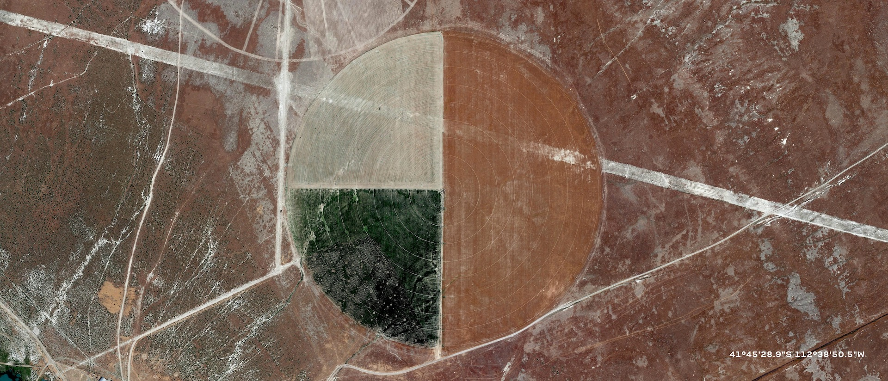
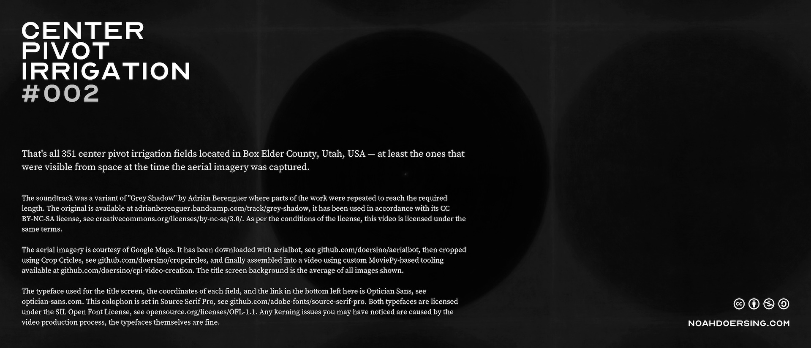

# cpi-video-creation

A quickly-thrown-together tool for making [videos like this one](https://www.youtube.com/watch?v=e6dB6rXYlXo), intended for use with aerial imagery downloaded by [ærialbot](https://github.com/doersino/aerialbot) and cropped using [Crop Circles](https://github.com/doersino/cropcircles).

*This repository is probably not very interesting to you unless you're planning on using [MoviePy](https://zulko.github.io/moviepy/) yourself and are looking for an example project before you dive in.*

Each video created by this tool consists of three segments – a *title card*, a *sequence of images* (the average of which is used as the title card background) with a soundtrack, and an *end card* with further information:







## Setup

Take a look at the [setup instructions for MoviePy](https://zulko.github.io/moviepy/) and check if there's anything special to be done on your system. On mine, setting up MoviePy entails installing [ImageMagick](https://www.imagemagick.org) and *patching* it in order to force it to recognize the required typefaces (which are located in `assets/fonts/`).


### Patching ImageMagick's font list

MoviePy uses ImageMagick for text rendering, which is terrible in many ways but just shy of terrible enough for me to consider building an alternative. Besides the completely-missing support for proper kerning and ligatures and text formatting and I don't even know what else, the [Homebrew](https://brew.sh)-provided distribution of ImageMagick comes with its own list of fonts that references the fonts preinstalled on every macOS system, but not custom ones. (With other ImageMagick distributions or on a different operating system, things might work a bit differently, I don't know.) This list can be pretty-printed (in Python/MoviePy) with

```python
TextClip.list('font')
```

or, directly with ImageMagick, with:

```
$ convert -list font
```

At the top of the output of that command is the path of the font list – on my system, as of September 2020, that's `/usr/local/Cellar/imagemagick/7.0.10-28/etc/ImageMagick-7/type-apple.xml`. (Supposedly, ImageMagick will instead use `~/.magick/type.xml` if that exists, but it just kinda doesn't. ¯\\\_(ツ)\_/¯) You will need to edit that file and add an entry for each of the two typefaces this tool uses, with whatever paths are correct on your system. The following Works On My Machine™:

```xml
<type
    format="otf"
    name="OpticianSans"
    fullname="OpticianSans"
    family="OpticianSans"
    glyphs="/Users/noah/Library/Fonts/Optician-Sans.otf"
    />
<type
    format="ttf"
    name="SourceSerifPro"
    fullname="SourceSerifPro"
    family="SourceSerifPro"
    glyphs="/Users/noah/Library/Fonts/SourceSerifPro-Regular.ttf"
    />
```

You might need to repeat this process each time you update ImageMagick.


### And the rest

Assuming things have gone smoothly so far, let's proceed – I suggest using the `venv` module (which is conveniently included in your Python installation) to avoid dependency hell. Run the following commands to get the tool installed on your system:

```bash
$ git clone https://github.com/doersino/cpi-video-creation
$ python3 -m venv cpi-video-creation
$ cd cpi-video-creation
$ source bin/activate
$ pip3 install -r requirements.txt
```

(To deactivate the virtual environment, run `deactivate`.)


## Configuration & Usage

Open `cpi-video-creation.py` and modify the variables at the top of the file, then (after making sure the virtual environment is active):

```
$ python3 cpi-video-creation.py
```

(Yes, a config file would be more elegant, but that would imply stability, which I'm not willing to commit to – the kinds of videos I make with this tool could well evolve in future.)


## License

You may use this repository's contents under the terms of the *MIT License*, see `LICENSE`.

However, the subdirectory `assets/fonts/` contains third-party fonts licensed under the *SIL Open Font License Version 1.1*, a copy of which is included with each of them.

Further, the subdirectory `assets/cc/` contains Creative Commons License icons, which appear to be licensed under the *Attribution 4.0 International License*, see [here](https://creativecommons.org/licenses/by/4.0/).

Finally, the two files `assets/beep.wav` and `assets/boop.wav` are recordings of my phone being bumped against my stove's power knobs. Since it took literally seconds to create them, you may use them as you like.


---

This last section is just a reminder to myself.


### Soundtrack editing checklist

* [ ] Only use CC-licensed music, say, off Bandcamp.
* [ ] Use https://getsongbpm.com/tools/audio to get an estimate of the BPM if it's not obvious – Audacity's built-in tooling is not great in this area.
* [ ] In Audacity, add labels via "Analyze > Regular Interval Labels...", move them around to make their beginning coincide with the first beat.
* [ ] Can adjust the tempo of the soundtrack via "Effect > Change Tempo...", where the old BPM can be set for reference.
* [ ] Can usually clone sections of audio with widths that are multiples of 8 with regard to beat labels in order to boost the soundtrack length.


### Video rendering checklist

* [ ] Verify that the "#00X" number in the video is correct.
* [ ] Verifly that the soundtrack is attributed correctly and the license icons are set accordingly.
* [ ] Make sure there are no typos.
* [ ] Set width to 4K, i.e. 3840.
* [ ] Keep tabs on RAM use if the video is longer than 4 minutes.


### Video uploading checklist

* [ ] Set title like "Center Pivot Irrigation #00X — Location, Location Subtitle" (that's an em dash, type <kbd>alt</kbd> <kbd>shift</kbd> <kbd>-</kbd>).
* [ ] For video description, take end card texts, remove extra line breaks, make sure to replace `{image_count}` with the value shown in the video, and add "https://" in front of every URL.
* [ ] Add to playlist "Center Pivot Irrigation".
* [ ] In "Audience", check "No, it's not made for kids".
* [ ] Set location to whatever location is appropriate.
* [ ] Set category to "Science & Technology".
* [ ] Keep visiblity as "Private" at least until the HD/4K version has finished processing.
